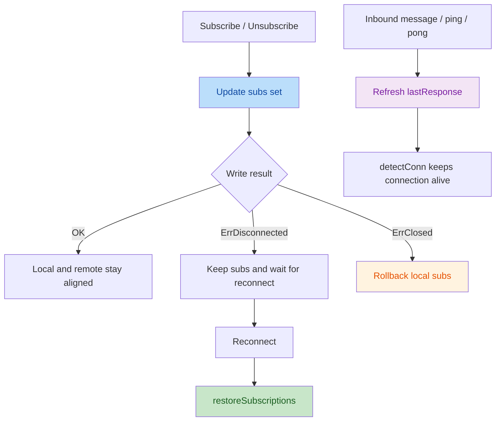

# Stream Ingest

> ⬅️ [Back to README](../README.md)
> 📖 [Docs index](index.md)
> 🧱 [Architecture & KeyRange convention](architecture.md)
> 🧭 [How-to & examples](howto.md)
> 🏷️ [Typed document helpers](typed-document.md)
> 🪝 [Write Hook Subsystem](write-hooks.md)

`stream` is a small reconnecting websocket ingestion layer for `x.Document`
output.

It exposes one `Stream` type.

## Positioning

This package is not a generic browser-style websocket helper.

It is meant for one focused job: consume external websocket streams and feed
their payloads into `redisx` document workflows.

It targets websocket protocols where:

- one endpoint can carry multiple logical subscriptions
- subscriptions can be added or removed on the existing connection
- reconnect should restore the current subscription set

WebSocket itself only provides transport. Semantics such as `SUBSCRIBE` and
`UNSUBSCRIBE` belong to the protocol running on top of the websocket
connection.

## Stream

Use `Start` when the full subscription set is already encoded in the endpoint
URL.

```go
type TradeDocument string

func (TradeDocument) Namespace() string  { return "trade" }
func (TradeDocument) Mem() bool          { return false }
func (TradeDocument) KeyAttrs() []string { return []string{"s"} }
func (d TradeDocument) RawJSON() string  { return string(d) }
func (TradeDocument) TTL() time.Duration { return time.Minute }

s := stream.Start[TradeDocument]("wss://example/ws?streams=btcusdt@aggTrade/ethusdt@aggTrade")

// Enable active websocket ping when the server expects client-side keepalive.
s = stream.Start[TradeDocument](
    "wss://example/ws?streams=btcusdt@aggTrade/ethusdt@aggTrade",
    30*time.Second,
)

out := s.C()
_ = s.Write([]byte(`ping`))
```

`Start` will:

- dial the endpoint
- read messages continuously
- allow raw writes on the same connection
- reconnect with backoff when the connection is lost

## Subscription-Aware Usage

Use `StartSubscribable` when subscriptions are connection state instead of URL
state.

```go
type TradeDocument string

func (TradeDocument) Namespace() string  { return "trade" }
func (TradeDocument) Mem() bool          { return false }
func (TradeDocument) KeyAttrs() []string { return []string{"s"} }
func (d TradeDocument) RawJSON() string  { return string(d) }
func (TradeDocument) TTL() time.Duration { return time.Minute }

s := stream.StartSubscribable[TradeDocument](
    "wss://example/ws",
    buildSubscribeMessage,
    buildUnsubscribeMessage,
    30*time.Second,
)

out := s.C()

_ = s.Subscribe("btcusdt@aggTrade", "ethusdt@aggTrade")
_ = s.Subscribe("bnbusdt@aggTrade")
_ = s.Unsubscribe("ethusdt@aggTrade")
current := s.List()
_ = s.Write([]byte(`{"method":"LIST_SUBSCRIPTIONS","id":1}`))
```

`Stream` keeps:

- one current connection
- one in-memory subscription set
- one bound subscribe format
- one bound unsubscribe format
- automatic reconnect
- automatic subscription restore after reconnect

## Architecture



## Semantics

- `endpoint` identifies the connection target
- subscription params are protocol-level subscription items, not plain symbols
- `StartSubscribable` binds one subscribe/unsubscribe format to one `Stream`
- passing one `time.Duration` to `Start...` enables active websocket ping
- `Subscribe` and `Unsubscribe` reuse the current connection instead of opening
  a new one
- `List` returns the current in-memory subscription set in sorted order
- if the connection is temporarily down, subscription changes update memory
  first and are restored after reconnect
- calling `Subscribe` / `Unsubscribe` on a plain `Start` stream is invalid
- `Start` and `StartSubscribable` assert on empty endpoints

For example, `btcusdt@aggTrade` is a subscription item. It is not only a
symbol, because it also includes the stream kind.

## Boundaries

This package does not:

- split subscriptions across multiple endpoints
- infer exchange routes from subscription names
- define exchange-specific symbol naming rules
- merge business models on top of raw payloads

Callers are responsible for choosing the correct endpoint for the subscription
set they want to carry on one connection.
